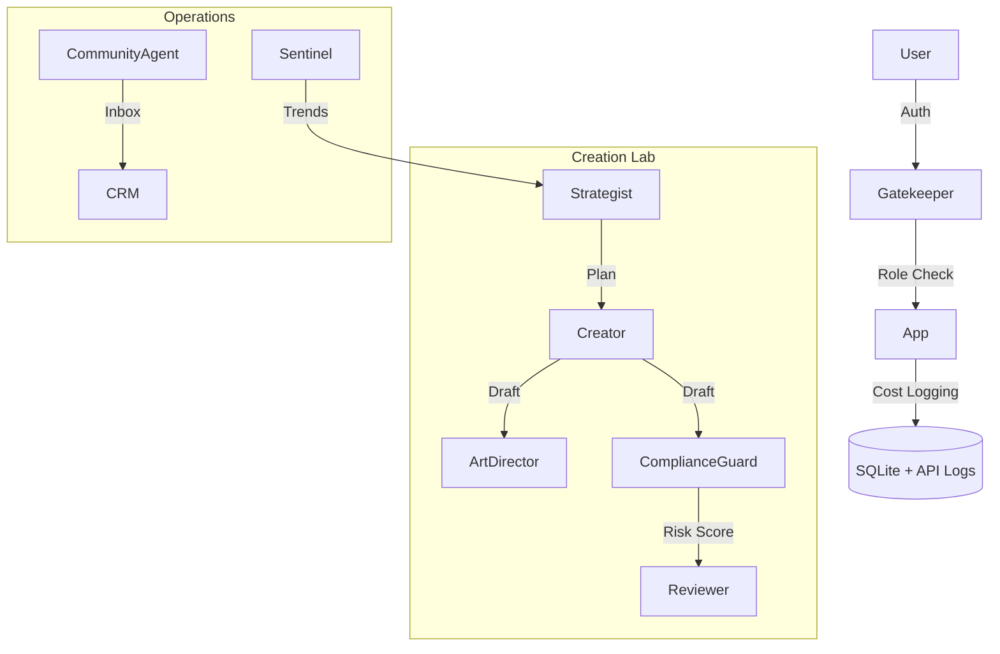

# Deviceterra Enterprise Edition 🏢

[](https://www.python.org/downloads/)
[](https://streamlit.io)
[](https://deepmind.google/technologies/gemini/)

**Deviceterra Enterprise** is the ultimate AI Operating System for Corporate Communications. It upgrades the original Blaze Protocol with enterprise-grade governance, financial tracking, and advanced multi-agent orchestration.

---

## ✨ Enterprise Features

### 🏢 Headquarters & Governance
- **Cost Intelligence**: Real-time tracking of every AI token burned. Audit usage by Agent (Strategist vs. Creator) and Model (Gemini 1.5 Pro vs. Flash).
- **Role-Based Access Control (RBAC)**: Simulated multi-user environment (Admin, Editor, Writer) with permission gates.
- **Compliance Guard**: Automated legal and PR risk scanning for every post before it goes live.

### 🧠 Advanced Agent Fleet
- **The Sentinel**: 24/7 Social Listening agent that monitors competitors and sentiment trends.
- **Community Agent**: Unified Inbox with AI "Smart Replies" for LinkedIn, Twitter, and Instagram.
- **Video Director**: Expanded Script-to-Storyboard pipeline with NanoBanana (Gemini 3 Pro) integration.

### ⚡ Core Capabilities
- **Magic Studio**: A team of 4 specialized agents (Strategist, Creator, Art Director, Reviewer) working in sequence.
- **RAG Knowledge Base**: Ingests company manifestos and voice guidelines for on-brand generation.
- **Visual Studio**: Integrated AI image generation for custom asset creation.
- **Smart Scheduler**: Drag-and-drop calendar for pipeline management.

---

## 🏗️ Technical Architecture

Deviceterra Enterprise uses a **Hierarchical Multi-Agent System (HMAS)**:



---

## 🛠️ Quick Start

### 1. Prerequisites
- Python 3.9+
- A Google AI (Gemini) API Key

### 2. Installation
```powershell
git clone <your-repo-url>
cd weekly_content_system
pip install -r requirements.txt
```

### 3. Configuration
Copy the template and fill in your secrets:
```powershell
copy .env.example .env
```
Edit `.env`:
`GOOGLE_API_KEY=your_key_here`

### 4. Run the Application
```powershell
.\run.bat
```
Login with default credentials:
- **Admin**: Select "Admin User" in sidebar
- **Editor**: Select "Senior Editor"

---

## 📂 Documentation
- [User Manual](docs/USER_MANUAL.md) - How to use the features.
- [Technical Docs](docs/TECHNICAL_DOCS.md) - Deep dive into code & architecture.

---

## 🛡️ Security & BYOK
Deviceterra follows a **Bring Your Own Key (BYOK)** model. All credentials and database states are stored locally in your environment. Secrets are managed via `.env` and are explicitly excluded from version control.

---
*Powered by Google Gemini 2.0 & Streamlit.*
